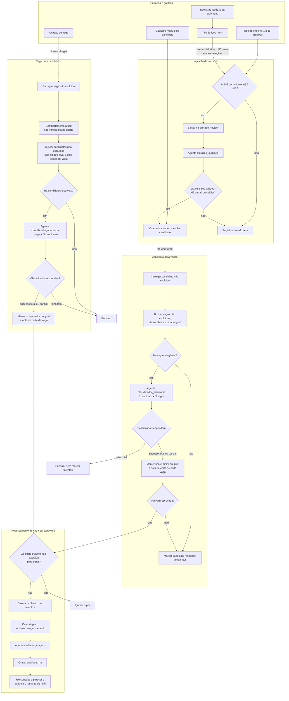

# Mapeamento dos fluxos de Inteligência Artificial

> Varredura estática realizada em 04/09/2026. Este documento descreve o
> comportamento observado no código atual. Quando a documentação e a
> implementação divergem, o comportamento executável é destacado.

## Resumo executivo

A IA é executada dentro do processo Node.js da aplicação. Não existe fluxo n8n,
webhook de IA, fila externa ou worker separado. O motor possui três slots fixos e
configuráveis pela administração:

| Slot                      | Responsabilidade                                                           | Persistência da saída                                                                            |
| ------------------------- | -------------------------------------------------------------------------- | ------------------------------------------------------------------------------------------------ |
| `extracao_curriculo`      | Lê PDF, DOCX, PNG ou JPEG e produz o cadastro estruturado do candidato     | Dados normalizados em `candidatos` e entidades filhas; transcrição em `texto_curriculo_extraido` |
| `classificador_aderencia` | Dá um score de 0 a 100 para cada par candidato-vaga na fase de pré-seleção | Não persiste o score; ele existe somente durante a execução                                      |
| `avaliador_triagem`       | Produz o parecer detalhado do par aprovado pela fase anterior              | Uma linha 1:1 em `avaliacao_ia` ligada à `triagem`                                               |

Há duas direções de matching:

1. **Candidato recebido ou cadastrado → vagas abertas da mesma cidade.**
2. **Vaga criada → candidatos não excluídos das cidades da vaga.**

O classificador apenas pontua. A aplicação compara o score à `nota_corte` da
vaga. Um par aprovado cria uma triagem em `curriculo` / `em_andamento` e então
recebe uma avaliação detalhada. A IA não aprova, reprova nem avança a etapa do
funil automaticamente; essas decisões continuam sendo do RH.

## Diagrama Mermaid

## Gatilhos e condições de disparo

### 1. Cadastro manual de candidato

`createCandidato()` dispara `orquestrarParaCandidatoNovo()` depois de criar,
restaurar ou mesclar o candidato. O disparo ocorre mesmo quando nenhum currículo
foi anexado. Nesse caminho, o arquivo opcional é apenas armazenado; o agente de
extração não é chamado, pois os dados vieram do formulário.

Uma duplicidade é procurada primeiro por e-mail e depois por celular, incluindo
registros excluídos logicamente. Um registro excluído é restaurado; um ativo é
mesclado de forma aditiva. Se a mesclagem alterar dados, somente triagens ainda
em `curriculo` e `em_andamento` são excluídas logicamente antes do novo matching.

Fonte: `src/actions/candidatos.ts:95-218` e
`src/server/db/repositories/candidato.ts:625-799`.

### 2. Upload manual em lote

O envio de `/candidatos/upload-lote` aceita de 1 a 15 arquivos. A action cria
uma linha operacional `upload_lote_itens` por arquivo e retorna antes do fim do
processamento. Em background, até três arquivos são processados em paralelo.

Para cada arquivo:

1. altera o item para `processando`;
2. valida MIME e limite de 5 MB;
3. salva o original no storage;
4. executa `extracao_curriculo`;
5. valida e persiste/mescla o candidato;
6. dispara o matching candidato → vagas;
7. altera o item para `sucesso` ou `erro`.

A interface consulta o banco a cada dois segundos enquanto houver item pendente
ou em processamento.

Fonte: `src/actions/candidatos.ts:364-468` e
`src/components/upload-progress/upload-progress-store.tsx:11-65`.

### 3. Captação automática por e-mail

`instrumentation.ts` inicia o loop somente no runtime Node.js. O primeiro ciclo
não é executado imediatamente: ele ocorre no primeiro tick de
`EMAIL_CAPTURA_INTERVALO_MS`, cujo padrão é 60 segundos. O guard em `globalThis`
impede intervalos duplicados por HMR dentro do mesmo processo, e um tick é
ignorado se o ciclo anterior ainda estiver rodando.

O ciclo só continua se existir uma credencial IMAP ativa e não excluída. Ele:

- busca UIDs posteriores ao watermark `ultimo_uid_processado`;
- opcionalmente aplica `SINCE capturar_desde` no servidor IMAP;
- limita a busca a 20 mensagens por ciclo;
- não filtra remetente, assunto, corpo ou semântica de “parece currículo”;
- conserva apenas anexos com MIME PDF/DOCX/PNG/JPEG e até 5 MB;
- processa até três anexos em paralelo pelo mesmo pipeline do upload em lote.

Sem `capturar_desde`, a primeira captura começa no `uidNext` atual e ignora o
histórico. Com a data preenchida, a credencial nasce com watermark zero e faz
backfill limitado por data.

Falha de cota do provedor de IA impede o watermark de ultrapassar aquela
mensagem, permitindo nova tentativa no ciclo seguinte. Outras falhas consomem a
UID e não são tentadas novamente.

Fonte: `src/instrumentation.ts`, `src/server/email/captura-curriculos-loop.ts`,
`src/server/email/captura-curriculos.ts` e `src/lib/email/imap-client.ts`.

### 4. Criação de vaga

Depois de persistir uma vaga, `createVaga()` dispara
`orquestrarParaVagaNova()` em fire-and-forget. A intenção expressa nos nomes e
testes é processar uma vaga aberta. Porém, o código atual chama o orquestrador
para **qualquer status criado**, e o orquestrador apenas verifica soft delete;
não exige `status = aberta`. Assim, uma vaga criada como `pausada`, `cancelada`,
`concluida` ou `incompleta` pode gerar triagens automáticas.

Fonte: `src/actions/vagas.ts:45-57` e
`src/server/agents/orquestracao.ts:91-128`.

### Eventos que não disparam IA

- editar candidato por `updateCandidato()`;
- editar vaga, inclusive mudar seu status de pausada para aberta;
- criar uma triagem manual por `createTriagem()`;
- avançar, reprovar, aprovar ou encerrar uma triagem;
- iniciar a aplicação, fora o agendamento do loop de e-mail;
- falha anterior do matching ou do avaliador: não existe job periódico geral de
  reprocessamento.

## Pré-condições para cada chamada de IA

Cada slot precisa ter uma linha `agente_config` não excluída e `ativo = true`.
O provedor configurado precisa existir no registry e possuir uma credencial LLM
ativa e não excluída. A administração impede ativar uma configuração sem
credencial ativa, mas uma credencial pode ser desativada posteriormente.

Os provedores implementados no código são:

- `google_ai_studio` (Gemini);
- `openai` (Responses API);
- `anthropic` (Messages API com tool use forçado).

As credenciais são cifradas em repouso com AES-256-GCM e a chave mestra vem de
`AGENT_CREDENTIALS_ENCRYPTION_KEY`. Cada resposta precisa obedecer ao JSON Schema
do slot e passar pela validação Zod antes de ser usada.

Cada chamada ao provedor tem até três tentativas, com esperas de 500 ms e 1 s
entre elas. A política reaplica a tentativa para falha de rede/provedor, cota e
resposta malformada.

Fonte: `src/lib/agents/agent-client.ts`, `src/lib/agents/shared.ts`,
`src/actions/agente-config.ts` e `src/server/db/repositories/llm-credencial.ts`.

## Etapas do fluxo

### Etapa 1 — Extração e normalização do currículo

Esta etapa existe apenas para upload em lote e e-mail. DOCX é convertido para
texto com `mammoth`; PDF, PNG e JPEG são enviados ao provedor como entrada
multimodal. A resposta contém dados pessoais, resumo profissional, transcrição,
formações, experiências e certificações.

Data de nascimento, CEP, bairro, logradouro, e-mail e celular podem ficar
ausentes; os campos são registrados em `dados_pendentes`. Nome, UF, cidade e
resumo profissional continuam obrigatórios. Se e-mail e celular estiverem ambos
ausentes, o candidato não é criado.

### Etapa 2 — Deduplicação e persistência do candidato

O pipeline procura primeiro e-mail e depois celular, inclusive entre excluídos:

- inexistente: cria candidato e filhos em transação;
- excluído: restaura o candidato e adiciona novos filhos;
- ativo: mescla apenas valores preenchidos/diferentes e adiciona filhos ainda
  não encontrados por suas chaves simplificadas.

Depois do commit, o matching é disparado sem bloquear a resposta do intake.

### Etapa 3 — Pré-seleção pelo classificador

O classificador recebe um item principal e uma lista de comparação. Listas são
quebradas em blocos de 25, com até três blocos processados em paralelo. A saída
esperada é uma lista de `{ id, score }`; IDs que não pertenciam à entrada são
descartados.

Se todos os blocos falharem, o resultado é tratado como falha de infraestrutura.
Se somente alguns falharem, os scores dos blocos bem-sucedidos continuam sendo
usados e os itens dos blocos com erro desaparecem daquela rodada.

### Etapa 4 — Corte e criação da triagem

Cada score é comparado com a `nota_corte` da vaga correspondente, inclusive
igualdade (`score >= notaCorte`). Para cada par aprovado:

1. consulta se já existe alguma triagem não excluída para o mesmo par;
2. se existir, ignora o par, qualquer que seja o resultado ou etapa anterior;
3. desmarca `em_banco_talentos` do candidato;
4. cria `triagem` com `etapa = curriculo` e `resultado = em_andamento`.

O banco também impede duas triagens simultâneas `em_andamento` para o mesmo par
por índice único parcial.

### Etapa 5 — Avaliação detalhada

Logo depois de criar a triagem, o slot `avaliador_triagem` recebe os dados
escalares do candidato e a vaga com cargo, departamento e cidades. Sua saída é:

- `vagaFoiInferida`;
- pontos fortes;
- requisitos faltantes;
- critérios eliminatórios falhos;
- alertas;
- `scoreIa` de 0 a 100;
- parecer textual.

Essa saída é persistida em `avaliacao_ia`. O score da avaliação não altera a
triagem e não é comparado novamente com a nota de corte.

### Etapa 6 — Decisão humana

O RH vê o score e o parecer nas listas e no detalhe da triagem. Alterações de
etapa, resultado, motivo e pareceres do RH são manuais. A IA funciona como
pré-seleção e apoio à decisão, não como decisão final automatizada.

## Filtros de escolha de vagas e candidatos

### Candidato novo → vagas

| Ordem | Filtro efetivo                                                                                                                                                 |
| ----- | -------------------------------------------------------------------------------------------------------------------------------------------------------------- |
| 1     | Candidato precisa existir e não estar soft-deleted.                                                                                                            |
| 2     | Vaga precisa estar não excluída e com `status = aberta`.                                                                                                       |
| 3     | A vaga precisa possuir uma relação cidade não excluída cuja cidade não excluída tenha `nome` exatamente igual a `candidato.cidade`.                            |
| 4     | O classificador pontua usando apenas `candidato.resumoProfissional` contra título do cargo, departamento, requisitos obrigatórios, desejáveis e eliminatórios. |
| 5     | O score precisa ser maior ou igual à nota de corte daquela vaga.                                                                                               |
| 6     | Não pode existir nenhuma triagem não excluída anterior para o par candidato-vaga.                                                                              |

Se não houver vaga nos passos 2 e 3, ou nenhuma passar no passo 5, o candidato é
marcado em `em_banco_talentos`. Falha total do classificador não marca banco de
talentos, para não confundir indisponibilidade técnica com baixa aderência.

### Vaga nova → candidatos

| Ordem | Filtro efetivo                                                                                                                                               |
| ----- | ------------------------------------------------------------------------------------------------------------------------------------------------------------ |
| 1     | A vaga precisa existir e não estar soft-deleted. **O status não é filtrado no código atual.**                                                                |
| 2     | Seleciona candidatos não soft-deleted cuja `cidade` seja exatamente igual ao nome de uma das cidades da vaga. Candidatos no banco de talentos são incluídos. |
| 3     | O classificador pontua o resumo da vaga contra apenas `candidato.resumoProfissional`.                                                                        |
| 4     | O score precisa ser maior ou igual à nota de corte da vaga nova.                                                                                             |
| 5     | Não pode existir nenhuma triagem não excluída anterior para o par.                                                                                           |

### Dados que não são filtros prévios

Os campos abaixo não excluem candidatos/vagas antes do classificador:

- UF;
- cargo ou área de interesse do candidato;
- remuneração/faixa ou pretensão salarial;
- disponibilidade de horário, viagens, mudança ou início imediato;
- CNH, veículo, escolaridade, PCD;
- quantidade de posições disponíveis;
- origem do candidato;
- existência de dados pendentes;
- existência de currículo anexado;
- estado de banco de talentos.

Alguns desses dados escalares podem chegar à avaliação detalhada, mas não à
fase 1. Formações, experiências e certificações normalizadas também não são
carregadas pelo `findByIdWithJoins()` usado pelo avaliador; ele recebe o registro
base do candidato. A transcrição completa do currículo pode compensar parte
dessa ausência quando estiver preenchida.

## Concorrência, tolerância a falhas e persistência operacional

| Ponto          | Limite/comportamento                                          |
| -------------- | ------------------------------------------------------------- |
| Upload em lote | até 15 arquivos; 3 processamentos simultâneos                 |
| E-mail         | até 20 mensagens por ciclo; 3 anexos simultâneos              |
| Classificador  | blocos de 25 itens; 3 blocos simultâneos por orquestração     |
| Avaliador      | até 3 pares simultâneos por orquestração                      |
| Provedor       | 3 tentativas por chamada, sem limitador global de RPM/RPD/TPM |

Os limites são locais a cada chamada. Múltiplos uploads, ciclos ou
orquestrações podem somar concorrência acima desses números. Não existe fila
durável, lock distribuído, tabela de job para matching/avaliação ou rate limiter
global.

## Pontos importantes encontrados

### Prioridade alta

1. **Vaga não aberta pode gerar triagens.** `createVaga()` sempre dispara o
   orquestrador e `orquestrarParaVagaNova()` não valida `status = aberta`. Isso
   contradiz o nome do fluxo e o teste chamado “without triggering classifier”,
   que não contém uma asserção sobre o disparo.
2. **Falha do avaliador deixa uma triagem sem avaliação e sem recuperação.** A
   triagem é criada antes da chamada do avaliador, sem transação conjunta. Se a
   fase 2 falhar, `existsForPar()` passa a bloquear novas tentativas para aquele
   par. O resultado individual de `runWithLimit()` também não é inspecionado
   pelo orquestrador.
3. **Fire-and-forget não é uma fila durável.** Criação de candidato, criação de
   vaga e processamento de lote retornam enquanto o trabalho continua apenas na
   memória do processo. Reinício, crash, scale-down ou múltiplas instâncias
   podem perder, duplicar ou deixar itens em `pendente/processando`. Não há rotina
   de retomada. A mensagem “mantido ativo para reprocessamento” após falha do
   classificador não corresponde a um reprocessamento agendado existente.
4. **Matching geográfico é frágil.** A comparação é textual, sensível a
   maiúsculas, acentos e grafia, e ignora UF. Isso pode produzir falso negativo
   (`Goiania` x `Goiânia`) ou falso positivo quando duas cidades de UFs
   diferentes têm o mesmo nome.
5. **Sucesso parcial do classificador pode virar decisão incompleta.** Quando um
   bloco falha e outro funciona, o resultado global é `ok: true`. Itens do bloco
   falho são omitidos; no sentido candidato → vagas, isso pode inclusive levar o
   candidato ao banco de talentos sem todas as vagas terem sido avaliadas.

### Segurança, auditoria e explicabilidade

6. **PII pode ser escrita nos logs em resposta inválida.** O parser comum registra
   a resposta completa recebida quando o JSON ou o Zod falham. Na extração isso
   pode conter dados pessoais e a transcrição integral do currículo, contrariando
   a orientação do ADR-0001 de não registrar `texto_curriculo_extraido` em logs.
7. **A decisão da fase 1 não é auditável.** Scores do classificador, motivo de
   exclusão, bloco processado, modelo, provedor, versão do prompt, tentativas,
   tokens, latência e custo não são persistidos. `avaliacao_ia` também não guarda
   a configuração que produziu o parecer. Alterar prompts/modelos afeta execuções
   futuras sem preservar proveniência das antigas.
8. **A fase 1 usa um retrato muito reduzido do candidato.** Somente o resumo
   profissional participa do corte. Critérios eliminatórios estruturados como
   CNH, formação ou disponibilidade podem não estar no resumo. O avaliador recebe
   mais campos escalares e a transcrição, mas não as coleções normalizadas de
   formação, experiência e certificação.

### Robustez e manutenção

9. **Há caminhos de arquivo órfão.** Se a extração retornar candidato sem e-mail
   e sem celular, a função retorna antes do cleanup do arquivo já salvo. Em
   mesclagens/restaurações, um novo currículo pode substituir a chave persistida
   sem remover o arquivo antigo. Nova tentativa de uma mensagem bloqueada por
   cota pode repetir anexos já bem-sucedidos do mesmo e-mail e ampliar esse
   efeito.
10. **MIME e extensão são validados de formas diferentes.** A entrada aceita pelo
    MIME é roteada pelo agente usando a extensão do nome. Um anexo com MIME
    válido e nome ausente/incorreto pode ser salvo e depois rejeitado como
    extensão não suportada.
11. **Atualizações não reavaliam automaticamente.** Editar um candidato, abrir
    uma vaga antes pausada ou alterar requisitos/nota de corte não dispara novo
    matching. Também não existe varredura periódica dos candidatos contra vagas
    atualizadas.
12. **A saída `vagaFoiInferida` não significa que a plataforma escolheu uma vaga
    por inferência.** A vaga já foi escolhida na fase 1; o campo indica apenas que
    o avaliador considerou os dados da vaga esparsos e inferiu parte do perfil.

### Divergências de documentação

- O README e o walkthrough ainda dizem que existem dois provedores; o código
  implementa três, incluindo Anthropic.
- README, walkthrough e a nota de implementação do ADR-0011 ainda citam
  parâmetros de geração por slot. A migration `0022_drop_agente_config_params`
  removeu `params`, e o schema/formulário atuais não os expõem.
- `PROJECT_STATE.md` ainda afirma que o detalhamento da IA virá em uma fase
  futura, embora o motor já esteja implementado.
- Alguns documentos dizem que o avaliador recebe `CandidatoCompleto`; o tipo e a
  consulta atuais usam `Candidato` sem as coleções filhas.

## Arquivos centrais da implementação

- Orquestração: `src/server/agents/orquestracao.ts`
- Extração: `src/server/agents/extracao-curriculo.ts`
- Classificação: `src/server/agents/classificador-aderencia.ts`
- Avaliação: `src/server/agents/avaliador-triagem.ts`
- Dispatcher e adapters: `src/lib/agents/`
- Intake compartilhado: `src/server/candidatos/processar-curriculo-recebido.ts`
- Upload/cadastro: `src/actions/candidatos.ts`
- Gatilho de vaga: `src/actions/vagas.ts`
- Loop IMAP: `src/instrumentation.ts` e `src/server/email/`
- Filtros de candidatos/vagas: `src/server/db/repositories/candidato.ts` e
  `src/server/db/repositories/vaga.ts`
- Triagem e avaliação persistida: `src/server/db/repositories/triagem.ts`
- Modelo persistente: `src/server/db/schema.ts`
- Decisões: ADR-0007, ADR-0010, ADR-0011, ADR-0013 e ADR-0014 em
  `docs/decisions/`

## Backlog de melhorias

### Observabilidade dos fluxos

- Criar, em `/logs`, um arquivo de log para cada um dos fluxos abaixo e
  registrar suas etapas significativas:
  - Entradas e gatilhos;
  - Ingestão de currículo;
  - Vaga para candidatos;
  - Candidato para vagas;
  - Processamento de cada par aprovado.
- Gerar logs estruturados com identificador de correlação, fluxo, etapa,
  entidades relacionadas, número da tentativa, duração e resultado do
  processamento.
- Não registrar currículos, respostas brutas dos agentes, credenciais ou outras
  informações pessoais nos logs. Mensagens de erro devem ser sanitizadas antes
  da gravação.
- Definir se `/logs` representa uma pasta na raiz do projeto ou um caminho
  absoluto configurável, além da política de rotação, retenção e tamanho máximo
  dos arquivos.

### Histórico e gestão dos processamentos de IA

- Persistir um histórico estruturado de todas as execuções dos fluxos de IA,
  incluindo sucessos e falhas, com informações suficientes para identificar o
  fluxo, a etapa, as entidades relacionadas, a mensagem sanitizada, as
  tentativas realizadas, as datas e o estado atual do processamento.
- Criar uma página que reúna todos os processos de IA registrados, tanto os
  bem-sucedidos quanto os que falharam.
- Exibir os processos dos fluxos `candidato_vagas` e `vaga_candidatos` em
  grupos separados, cada um em um componente `Accordion`, permitindo expandir
  os detalhes de cada execução.
- Permitir, nessa página, tentar novamente o processamento associado a cada
  falha.
- O reprocessamento deve ser idempotente, retomar exatamente a etapa que falhou
  e não duplicar candidatos, triagens ou avaliações.
- Impedir tentativas simultâneas para a mesma falha. Registrar a solicitação, o
  horário de início, o resultado e, quando houver identificação disponível, o
  usuário responsável pelo reprocessamento.
- Quando uma triagem já existir e apenas sua avaliação tiver falhado, executar
  novamente somente o avaliador e a gravação de `avaliacao_ia`.
- Quando apenas parte dos blocos do classificador falhar, registrar os blocos
  afetados e permitir reprocessar somente esses blocos. No fluxo candidato para
  vagas, não marcar o candidato no banco de talentos enquanto ainda houver
  blocos sem avaliação.

### Regra de permanência no banco de talentos

- Formalizar a regra de três meses, definindo qual data do candidato será usada
  no cálculo, se uma atualização do cadastro renova o período e qual fuso
  horário e limite temporal serão aplicados.
- Especificar a exceção de status `aprovado`, considerando que o candidato não
  possui status próprio: definir quais triagens e resultados caracterizam essa
  condição.
- Definir como e quando candidatos vencidos serão retirados periodicamente do
  banco de talentos, além da remoção feita durante os fluxos de matching.

### Ingestão de currículo

- Se `StorageProvider.save()` lançar uma exceção ao salvar o currículo,
  registrar a falha no log do fluxo e registrar o erro operacional do item.

### Vaga para candidatos

- Ao carregar uma vaga não excluída, verificar também se ela está aberta antes
  de continuar o processamento.
- Verificar novamente se a vaga continua aberta imediatamente antes de criar
  cada triagem.
- Buscar somente candidatos não excluídos e com cadastro de, no máximo, três
  meses. Esse limite define a participação no banco de talentos. Se o cadastro
  tiver mais de três meses, retirar o candidato do banco de talentos e não
  continuar seu processamento, exceto quando ele possuir status `aprovado`.
- Registrar todo erro ocorrido nesse fluxo.

### Candidato para vagas

- Buscar somente candidatos não excluídos e com cadastro de, no máximo, três
  meses. Se o cadastro tiver mais de três meses, retirar o candidato do banco de
  talentos e não continuar seu processamento, exceto quando ele possuir status
  `aprovado`.
- Registrar todo erro ocorrido nesse fluxo.

### Processamento de cada par aprovado

- Registrar todo erro ocorrido nesse fluxo.
