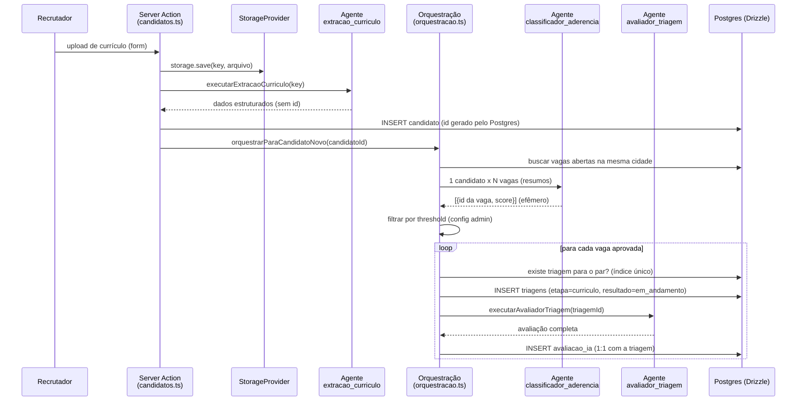

# Walkthrough Técnico — WGOTalent

Este documento explica **por que** o WGOTalent foi construído do jeito que foi:
as decisões de stack, os padrões arquiteturais e o fluxo de ponta a ponta do
módulo de triagem de candidatos com IA. Não duplica código — para o texto
completo de qualquer arquivo citado, siga o link.

Documentos irmãos: [README.md](README.md) (visão geral e setup),
[docs/ARCHITECTURE.md](docs/ARCHITECTURE.md) (spec original de arquitetura),
[docs/PRODUCT.md](docs/PRODUCT.md) (visão de produto), `docs/decisions/`
(ADRs), [docs/HARNESS.md](docs/HARNESS.md) (governança do agente de IA).

---

## 1. Por que Create T3 App só como scaffolder

O projeto nasceu com `create-t3-app` (ver `docs/DEVLOG.md`, marco
TASK-019, 2026-08-11), mas **estritamente como gerador de fundação inicial** —
não como arquitetura. Na criação já foram excluídos tRPC, Prisma e
Auth.js/NextAuth, e um marco de auditoria dedicado ("Validação do Greenfield
Agent Harness") confirmou que nenhuma instrução do projeto exigia essas peças.

O que **sobreviveu** do T3 e por quê:

- **Convenção de diretório `src/`** e `src/env.js` — o T3 já resolve validação
  tipada de variáveis de ambiente via `@t3-oss/env-nextjs`; reaproveitar isso
  evitou reinventar uma camada que já era a certa (ver `docs/DEVLOG.md`,
  TASK-026). Todo código server-side importa `env` de `~/env`, nunca
  `process.env` direto.
- **`pgTableCreator` com prefixo `wgotalent_`** em
  [src/server/db/schema.ts](src/server/db/schema.ts) — outra convenção T3
  (permite múltiplos projetos compartilharem um banco Postgres sem colisão de
  nomes de tabela), mantida porque é uma boa prática independente do resto do
  boilerplate.
- **Tailwind CSS 4**, já configurado pelo scaffold, virou a base do design
  system (seção 7).

O que foi **removido no mesmo commit inicial** (`chore: remove t3 scaffold
boilerplate`): rotas de exemplo, tRPC router, qualquer vestígio de
Prisma/NextAuth. A partir daí o projeto seguiu App Router + Server
Actions + Drizzle puro, sem camada de API intermediária.

---

## 2. App Router, Server Components e Server Actions

Next.js App Router é usado **de ponta a ponta** — front e back no mesmo
processo, sem servidor de API separado (`docs/ARCHITECTURE.md`).

Duas regras fixam onde cada tipo de código pode viver:

1. **Leitura = Server Component.** Toda `page.tsx` sob `src/app/(rh)/`
   busca seus próprios dados direto do banco (via repository/Drizzle) dentro
   do próprio Server Component, sempre passando por `notDeleted()` (seção 4).
   Não existe fetch client-side para dados internos, nem route handler para
   leitura.
2. **Escrita = Server Action.** Toda mutação (criar/editar/soft-delete) para
   as entidades do domínio vive em `src/actions/*.ts` com `'use server'` no
   topo do arquivo (ex.: [src/actions/candidatos.ts](src/actions/candidatos.ts)).
   Cada action segue o mesmo contrato: valida com Zod → executa a mutação →
   chama `revalidatePath` para as rotas afetadas → devolve um `ActionState<T>`
   tipado (`{ success: true, data } | { success: false, errors }`).

Route Handlers (`src/app/api/`) ficam reservados para o que **não** é mutação
interna de domínio — hoje só `src/app/api/files/[...path]/route.ts`, que
serve os arquivos de currículo a partir do `StorageProvider` (seção 5),
mantendo-os fora de `public/` e atrás de um ponto único de acesso.

Essa separação é o motivo pelo qual o MVP consegue rodar **sem
autenticação** hoje e adicionar auth depois sem reescrever nada: Server
Actions e Route Handlers já são o único portão de mutação/acesso — um
middleware de auth entra ali, e não espalhado pelos Server Components.

---

## 3. Drizzle ORM e migrations — schema-first

Drizzle foi escolhido no lugar do Prisma que o T3 oferece por padrão porque o
projeto quer **schema-first em TypeScript puro**, sem gerar um client
proprietário nem um schema em DSL própria.

Fluxo:

- **Fonte da verdade**: [src/server/db/schema.ts](src/server/db/schema.ts) —
  ~13 tabelas (`departamentos`, `cargos`, `vagas`, `candidatos`,
  `candidatoFormacoes`, `candidatoExperiencias`, `candidatoCertificacoes`,
  `uploadLoteItens`, `triagens`, `avaliacaoIA`, `llmCredenciais`,
  `agenteConfig`, `emailCredenciais`), todas via `createTable()` (o
  `pgTableCreator` herdado do T3, seção 1). O modelo de domínio canônico de
  referência (nomes de campos, tipos, enums) é
  [docs/db_triagem_proposta.ts](docs/db_triagem_proposta.ts) — qualquer
  mudança de schema é checada contra esse arquivo antes de virar código.
- **Geração de migration**: `npm run db:generate` (`drizzle-kit generate`)
  lê o schema TS e emite SQL versionado em `drizzle/`. Nenhuma migration é
  escrita à mão.
- **Aplicação**: `npm run db:migrate` (`drizzle-kit migrate`) roda o SQL
  gerado contra `DATABASE_URL`.
- **Proibição explícita de Postgres MCP** (`docs/HARNESS.md`, §4.2) — toda
  alteração de banco passa por esse fluxo Drizzle, nunca por uma ferramenta
  MCP conectada direto ao Postgres. Isso mantém o histórico de schema
  auditável e reproduzível a partir do código.
- **Camada de repositório**: `src/server/db/repositories/*` encapsula as
  queries Drizzle por entidade (ex. `candidatoRepository`,
  `triagemRepository`), sempre passando pelo helper de soft delete da seção
  4 — Server Components e Server Actions não escrevem `db.select()` cru.

---

## 4. Soft delete — invariante de todo o domínio

Nenhuma tabela sofre `DELETE` real. Toda tabela tem `deletedAt: timestamp`
(junto de `createdAt`/`updatedAt`), e "excluir" é sempre um `UPDATE` setando
`deletedAt = now()`.

O ponto central é [src/server/db/query-helpers.ts](src/server/db/query-helpers.ts):
a função `notDeleted(qb, table, ...condicoesExtras)` envolve qualquer query
builder Drizzle e injeta `isNull(table.deletedAt)` no `WHERE`. **Nenhuma
query no projeto escreve `isNull(...)` inline** — sempre passa por esse
helper, para que a exclusão lógica não possa ser esquecida em uma query nova.

Duas consequências de design que valem registrar:

- **Cascata é responsabilidade da aplicação, não do FK.** Soft-deletar um
  `Candidato` precisa também soft-deletar suas `Formacao`/`Experiencia`/
  `Certificacao`/`Triagem` (e, transitivamente, a `AvaliacaoIA` ligada) —
  tudo dentro de uma única `db.transaction()` na action `deletarCandidato`.
  `ON DELETE CASCADE` do Postgres não dispara em soft delete, então isso tem
  que ser explícito em código.
- **Constraints `UNIQUE` continuam cheias, não parciais.** `Departamento.nome`
  e `Candidato.email` bloqueiam reuso mesmo com a linha antiga soft-deletada
  — decisão intencional (ver ADR-0003 e ADR-0008, que tratam o caso de
  candidato duplicado com um fluxo de restaurar/mesclar em vez de permitir
  duplicata livre).

---

## 5. StorageProvider — abstração de arquivo

Currículos nunca tocam `public/` nem chamam `fs` fora de um único lugar. A
interface [src/lib/storage/storage.ts](src/lib/storage/storage.ts) define o
contrato (`save`, `read`, `delete`, `getAccessReference`) com invariantes
explícitas: chave é gerada pela aplicação (UUID), nunca derivada de input do
usuário; `delete` é idempotente; a interface não valida tipo de conteúdo nem
tamanho — isso é responsabilidade de quem chama, antes de salvar.

A implementação atual (`LocalStorageProvider`, baseada em disco) é uma
escolha de MVP, não uma amarração — o objetivo declarado é trocar para
S3/Blob depois sem tocar em quem consome a interface. O único consumidor de
`fs` no projeto para arquivos de candidato é essa implementação; toda a
aplicação usa a interface, importada como `storage` a partir de
`~/lib/storage`. Leitura é servida via
`src/app/api/files/[...path]/route.ts`, o único Route Handler de leitura do
projeto — ponto único onde um gate de autorização pode ser adicionado depois.

---

## 6. Validação — Zod como única fonte, TanStack Form no client

Ver [docs/FORM_STACK.md](docs/FORM_STACK.md) para o detalhamento completo;
aqui vai o porquê.

- **Zod é a única biblioteca de schema do projeto.** Desde a v3.24 o Zod
  implementa nativamente o protocolo **Standard Schema** (`~standard`), o que
  eliminou a necessidade do adapter `@tanstack/zod-form-adapter` — um
  pacote a menos para manter.
- **Dois schemas por entidade, fronteira client/server clara**:
  `src/lib/validation/<entidade>.ts` (schema "server", derivado via
  `createInsertSchema` do `drizzle-orm/zod` — usado pelas Server Actions como
  barreira de segurança independente do client) e
  `src/lib/validation/<entidade>.client.ts` (estende o server schema só para
  trocar mensagens de erro para português — usado exclusivamente pelos
  componentes de formulário, nunca por uma action). Regras de negócio
  (ex.: `motivo` da Triagem só é obrigatório quando `resultado` é
  `reprovado`/`desistente`) são aplicadas nos dois lados — a UI não é a única
  linha de defesa.
- **TanStack Form (`@tanstack/react-form`) no lugar de React Hook Form** —
  decisão para ficar consistente com o ecossistema TanStack já usado no
  projeto e ter suporte nativo a Standard Schema sem adapter. O form recebe o
  client schema direto em `validators: { onChange: clientSchema }`.
  `@tanstack/react-form-nextjs` não foi instalado — o fluxo de submit é
  simples o bastante (form client chama a Server Action via
  `onSubmit`) para não precisar da integração extra.
  Ver [src/components/candidato-form.tsx](src/components/candidato-form.tsx)
  para o exemplo mais completo (agrega candidato + formações + experiências +
  certificações num único form).

---

## 7. shadcn/ui + Tailwind

Tailwind CSS 4 veio do scaffold T3 (seção 1) e virou a base do design system.
Sobre ela, os componentes vêm do **shadcn/ui**, sempre adicionados via CLI
oficial (`npx shadcn@latest add <componente>`) — `docs/HARNESS.md` (§4.3)
proíbe explicitamente usar ferramentas MCP para isso quando a CLI resolve
direto no projeto.

Padrão adotado: quando um componente shadcn precisa de estilo além do
padrão, cria-se um **novo componente** que envolve o shadcn original com as
classes Tailwind adicionais, em vez de editar o arquivo gerado pela CLI —
isso mantém o componente base fácil de re-sincronizar com upgrades futuros do
shadcn. `lucide-react` é o único pacote de ícones do projeto (ver
ADR-0009).

---

## 8. Motor de agentes nativo de IA (ADR-0007)

### 8.1 Por que não n8n

O plano original orquestrava a triagem via 3 workflows n8n (`Cadastro_Candidato`,
`Classificador`, `Triagem`) — documentado em ADR-0004/0005/0006. Nenhuma
dessas integrações chegou a ser implementada em código antes da decisão de
mudar, o que baixou o custo da virada. O
[ADR-0007](docs/decisions/0007-encerramento-integracao-n8n.md) encerrou essa
linha e formalizou: os 3 fluxos eram pipelines sequenciais simples
(extração → classificação → avaliação), sem orquestração complexa que
justificasse manter um motor de workflow externo. Trazer isso para dentro da
plataforma elimina saltos de webhook a cada etapa, centraliza logs/custo de
chamadas de IA, e principalmente permite configurar prompt/modelo/provedor
**via admin, sem redeploy** — algo que a UI de nós do n8n não dava sem virar
um segundo sistema para manter.

### 8.2 Como o motor funciona

Três "slots" fixos de agente, mapeados 1:1 aos antigos nós n8n — o **schema
de saída de cada slot é fixo em código**; o que é editável via admin
(`src/app/admin/agentes/[slot]/page.tsx` → `src/actions/agente-config.ts`) é
só prompt de sistema, prompt de usuário, provedor/modelo e parâmetros:

| Slot | Papel | Módulo |
|---|---|---|
| `extracao_curriculo` | Lê o currículo (PDF/imagem multimodal ou DOCX via `mammoth`) e devolve dados estruturados — nunca um id, candidato/vaga ainda não existem no banco nesse ponto | [src/server/agents/extracao-curriculo.ts](src/server/agents/extracao-curriculo.ts) |
| `classificador_aderencia` | Recebe 1 item ("candidato" ou "vaga") + N itens de comparação, devolve `{id, score}` por item — pontuação efêmera, nunca persistida | [src/server/agents/classificador-aderencia.ts](src/server/agents/classificador-aderencia.ts) |
| `avaliador_triagem` | Roda por par candidato-vaga já aprovado, grava a avaliação completa (`avaliacao_ia`) | [src/server/agents/avaliador-triagem.ts](src/server/agents/avaliador-triagem.ts) |

Peças de suporte, todas em `src/lib/agents/`:

- **`agent-client.ts`** — ponto único chamado pelos 3 agentes; lê
  `agenteConfig.provider` e despacha para o client do provedor configurado.
  Nenhum agente importa `gemini-client.ts`/`openai-client.ts` diretamente
  (ver [ADR-0011](docs/decisions/0011-multiplos-provedores-llm.md)).
- **`shared.ts`** — contrato comum (`GerarRespostaEstruturadaInput<T>`),
  retry com backoff exponencial e parse+validação Zod da resposta,
  compartilhados pelos dois clients — cada client só implementa a chamada
  HTTP e a extração do texto de saída específicas do seu provedor.
- **`gemini-client.ts`** — chama `@google/genai` (Gemini via Google AI
  Studio); foi o único novo pacote de dependência aprovado no bloco original
  do motor de agentes (`AGENTS.md` exige aprovação para qualquer dependência
  nova).
- **`openai-client.ts`** — chama a Responses API da OpenAI
  (`/v1/responses`) via `fetch` nativo, sem SDK — não precisou de
  dependência nova. Usa `text.format.type: "json_schema"` (strict mode) como
  equivalente ao `responseJsonSchema` do Gemini; os schemas JSON dos 3
  agentes foram ajustados para satisfazer as duas exigências do modo strict
  da OpenAI (todo campo em `required`, `additionalProperties: false`) e
  continuar válidos para o Gemini ao mesmo tempo — um schema serve os dois
  provedores.
- **`template.ts`** — resolve variáveis `{{nome}}` nos prompts a partir de um
  catálogo por slot; lança erro se o template referenciar uma variável fora
  do catálogo (nunca falha silenciosamente com string vazia).
- **`crypto.ts`** — cifra/decifra as credenciais de LLM (e, desde a
  captação por e-mail, as credenciais IMAP) guardadas no banco, desacopladas
  da config de cada agente.
- **`provider-catalog.ts`** — lista os provedores/modelos disponíveis para a
  UI de admin; um provedor só vira opção real quando ganha um client
  implementado — hoje `google_ai_studio` e `openai`, ambos com backend.

O prompt de `classificador_aderencia` é **direção-agnóstico por design**:
variáveis genéricas (`item_principal`, `itens_comparacao`,
`tipo_principal`/`tipo_comparacao`) em vez de nomes fixos como
`candidato_resumo`/`vagas_resumo` — o mesmo prompt serve tanto para
"candidato novo comparado contra vagas abertas" quanto para "vaga nova
comparada contra candidatos ativos"; só o código orquestrador
([src/server/agents/orquestracao.ts](src/server/agents/orquestracao.ts))
sabe qual direção disparou e como interpretar os ids retornados.

---

## 9. Fluxo candidato → triagem → IA

Pontos-chave desse fluxo, todos decisões deliberadas (não acidentes de
implementação):

- **Nenhum agente é fonte de id.** `extracao_curriculo` devolve dados soltos;
  o id só existe depois do `INSERT` no Postgres (`defaultRandom()` nas
  tabelas). Isso evita todo um universo de bugs onde o LLM "inventa" ou
  reusa um id que já existe.
- **A direção do disparo depende de quem é novo.** Candidato novo é
  comparado contra o estoque de vagas abertas; vaga nova é comparada contra o
  estoque de candidatos ativos — assim registros antigos do outro lado nunca
  ficam de fora só por terem sido cadastrados antes.
- **Fase 1 (classificação) é em lote, não um loop por par.** Uma única
  chamada de LLM carrega o item "1" e o array de itens "N" (limite de ~25 por
  chamada; lotes maiores são fatiados pelo orquestrador, não pelo prompt).
  Isso é o que faz a comparação 1×N ser barata o suficiente para rodar em
  todo cadastro novo.
- **O LLM nunca decide aprovação.** Ele só retorna o score; a aplicação
  compara contra o threshold configurável em `agenteConfig` e só then decide
  quais pares avançam para a fase 2 (avaliação completa) e viram uma linha em
  `triagens`.
- **Reavaliação em edição**: editar um candidato que ainda está na etapa
  inicial "Currículo" soft-deleta as triagens `em_andamento` daquela etapa
  antes de re-disparar a orquestração — o perfil atualizado é reavaliado do
  zero; etapas mais avançadas (testes, entrevistas, finalizado) não são
  tocadas por uma edição de cadastro.
- **Candidato sem par aprovado vira banco de talentos automaticamente**
  (`candidatos.em_banco_talentos`, [ADR-0013](docs/decisions/0013-banco-de-talentos-automatico.md)):
  se não há vaga aberta na cidade, ou nenhuma passa no threshold da fase 1,
  `orquestrarParaCandidatoNovo` marca o candidato em vez de retornar em
  silêncio como fazia antes dessa decisão. O candidato sai do banco
  automaticamente no mesmo ponto único onde uma `Triagem` nova é de fato
  criada (`processarParAprovado`) — compartilhado pelos dois sentidos de
  orquestração, então uma vaga nova compatível reativa candidatos antigos do
  banco sem código extra.

---

## 10. Captação automática de currículo por e-mail (ADR-0010)

A captação por e-mail entrou no MVP depois do congelamento original —
antecipada do roadmap pós-MVP porque, ao contrário de autenticação ou
múltiplos provedores de LLM, é puramente aditiva: não toca em nenhum código
já validado do motor de agentes ou dos CRUDs (ver
[ADR-0010](docs/decisions/0010-captacao-curriculo-via-email.md)).

- **IMAP genérico, não SDK por provedor.** Zimbra, Google Workspace e M365
  todos falam IMAP — construir contra o protocolo em vez de 3 integrações
  proprietárias cobre os três com um client só
  ([src/lib/email/imap-client.ts](src/lib/email/imap-client.ts), `imapflow`
  + `mailparser`, as únicas dependências novas deste bloco).
- **Loop em processo, não cron externo.** `src/instrumentation.ts` (hook
  oficial do Next.js, roda uma vez por processo) inicia o loop
  ([src/server/email/captura-curriculos-loop.ts](src/server/email/captura-curriculos-loop.ts)),
  guardado em `globalThis` (não uma variável de módulo) porque o HMR do
  `next dev` recarregaria o módulo a cada save e reiniciaria o `setInterval`
  — `globalThis` sobrevive ao HMR, mesmo truque já usado para cachear a
  conexão do banco.
- **Idempotência por watermark de UID IMAP**, não por conteúdo de mensagem:
  cada ciclo busca só UID maior que `ultimoUidProcessado`, e o watermark só
  avança até o que o ciclo realmente processou — nunca além, nunca
  parcialmente, mesmo se o ciclo for interrompido no meio.
- **Extração compartilhada com o upload em lote.** O e-mail não tem seu
  próprio pipeline de extração/dedup/merge — reaproveita
  [src/server/candidatos/processar-curriculo-recebido.ts](src/server/candidatos/processar-curriculo-recebido.ts),
  extraído do upload em lote nesta mesma mudança, só trocando `origem` para
  `"email"`. Mesma lista de mimetypes/tamanho aceitos do upload manual — sem
  filtro adicional de "isso parece um currículo".
- **Corpo/assunto do e-mail nunca são persistidos nem logados** — só os
  bytes dos anexos elegíveis são extraídos; o resto da mensagem é descartado
  assim que os anexos são processados (ver
  [docs/SECURITY.md](docs/SECURITY.md#credenciais-de-e-mail-imap-em-repouso)).

---

## 11. Harness e skills — como o agente de IA trabalha neste repositório

`docs/HARNESS.md` formaliza onde vivem os artefatos que orientam o
assistente de IA e as regras de uso, para o trabalho ficar reproduzível entre
sessões e entre ferramentas (GitHub Copilot e Claude Code coexistem no
projeto):

- **Precedência de fonte**: `AGENTS.md`/`CLAUDE.md` e `docs/` > documentação
  oficial da versão instalada de cada lib > conhecimento geral do modelo.
- **Skills por camada** (`layer-db`, `layer-validation`, `layer-storage`,
  `layer-actions`, `layer-api`, `layer-ui`) — cada uma documenta o que pode
  viver em sua pasta e quais invariantes valem ali; ver a tabela de camadas
  em [AGENTS.md](AGENTS.md). Skills técnicas gerais (`drizzle-orm-patterns`,
  `tanstack-form`, `zod-validation-utilities`, `shadcn`,
  `tailwind-css-patterns`, etc.) ficam em `.agents/skills/`, com
  `.claude/skills/` e `.github/skills/` como symlinks para o mesmo diretório
  canônico — as duas ferramentas de IA enxergam exatamente as mesmas regras.
- **Skills de governança** (`drizzle-migration-check`,
  `soft-delete-check`, `repository-cleanliness-check`, `task-closeout`)
  atuam como portões de qualidade — auditam se uma mudança respeitou os
  invariantes deste documento (soft delete, sem dependência nova sem
  aprovação, sem lixo de arquivo) antes de a tarefa ser considerada fechada.
- **Política de skill mínima**: carregar só as skills necessárias para a
  tarefa atual (nunca todas de uma vez), para não estourar o contexto do
  modelo — uma tarefa de banco carrega só as skills de banco/migration; uma
  tarefa de UI carrega só as de UI/Tailwind.
- **MCP com escopo restrito**: GitHub MCP é opcional e só para operações
  remotas (PRs, issues) — operações locais (commit, status, diff) usam Git
  nativo no terminal. Postgres MCP é proibido por completo (seção 3). shadcn
  MCP é desencorajado em favor da CLI oficial (seção 7).
- **Uma tarefa por conversa**, com escopo de contexto enxuto — cada sessão de
  chat fica focada numa única TASK do roteiro do projeto, evitando que
  mudanças não relacionadas se misturem num mesmo diff.

---

## 12. Resumo — decisões e onde ler mais

| Decisão | Motivo resumido | Onde aprofundar |
|---|---|---|
| T3 só como scaffolder | Aproveitar `src/env.js` tipado e convenções de diretório sem herdar tRPC/Prisma/Auth.js | `docs/DEVLOG.md` (TASK-019), README.md |
| Server Actions como única mutação interna | Ponto único de gate para auth futura, sem reescrever Server Components | `docs/ARCHITECTURE.md` |
| Drizzle schema-first | TypeScript puro, sem DSL/client proprietário; Postgres MCP proibido | `docs/HARNESS.md` §4.2 |
| Soft delete + `notDeleted()` obrigatório | Nunca perder histórico; cascata é responsabilidade da aplicação | `src/server/db/query-helpers.ts` |
| `StorageProvider` | Trocar disco por S3/Blob sem tocar consumidores | `src/lib/storage/storage.ts` |
| Zod único + TanStack Form | Standard Schema nativo elimina adapters | `docs/FORM_STACK.md` |
| shadcn via CLI, não MCP | CLI resolve direto; menos ferramenta para manter | `docs/HARNESS.md` §4.3 |
| Motor de agentes nativo (não n8n) | 3 fluxos n8n eram pipelines simples; configurabilidade via admin sem redeploy | [ADR-0007](docs/decisions/0007-encerramento-integracao-n8n.md) |
| Fase 1 em lote / Fase 2 por par | Custo de comparação N-a-N baixo; avaliação rica só nos pares aprovados | `src/server/agents/orquestracao.ts` |
| Dispatcher por provedor (`agent-client.ts`) | Saída estruturada não é portável entre provedores; um contrato comum evita `if/else` triplicado nos 3 agentes | [ADR-0011](docs/decisions/0011-multiplos-provedores-llm.md) |
| Captação por e-mail via IMAP genérico + loop em processo | Cobre Zimbra/Workspace/M365 sem SDK proprietário; sem cron externo | [ADR-0010](docs/decisions/0010-captacao-curriculo-via-email.md) |
| Banco de talentos como coluna do Candidato, não Triagem sintética | Candidato sem vaga compatível não tem processo seletivo para anexar um resultado | [ADR-0013](docs/decisions/0013-banco-de-talentos-automatico.md) |
