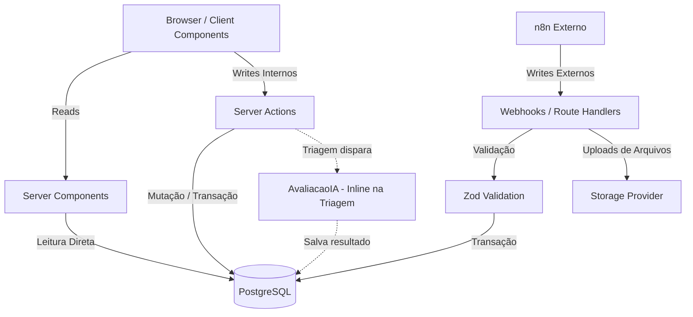

# Arquitetura do Sistema - WGOTalent

Este documento define a arquitetura Greenfield para o projeto WGOTalent, adotando um subconjunto específico de tecnologias voltado ao domínio de triagem de candidatos.

## 1. Visão Geral da Stack

- **Framework:** Next.js (App Router)
- **Banco de Dados:** PostgreSQL
- **ORM:** Drizzle ORM
- **Infraestrutura:** PostgreSQL via Docker (Docker Compose). O n8n é executado **fora** do Compose (ambiente externo).

## 2. Diagrama de Arquitetura



## 3. Fluxo de Dados e Integrações

- **Reads (Leituras):** Realizados exclusivamente via **Server Components**.
- **Writes Internos:** Realizados exclusivamente via **Server Actions**.
- **Writes Externos (n8n):** O n8n se comunica via **Webhooks** no Next.js (Route Handlers). O payload deve passar sempre por validação com **Zod**, seguida de uma transação no Drizzle.
- **Arquivos:** O manuseio de arquivos é feito utilizando um `StorageProvider` chamado a partir de um Route Handler.
- **Avaliação de IA:** A funcionalidade de `AvaliacaoIA` roda de forma **inline** dentro do processo de Triagem.

## 4. Estrutura de Diretórios

A estrutura de diretórios utiliza a convenção `src/`, reduzida aos domínios estritamente utilizados:

```text
src/
├── app/          # Rotas do App Router, Pages, Layouts, Route Handlers (webhooks)
├── actions/      # Server Actions isoladas
├── components/   # UI Components (Client e Server)
├── lib/          # Utilitários, hooks, providers e integrações externas
├── server/
│   └── db/       # Configuração do Drizzle ORM e definição de schemas
├── styles/       # CSS global (Tailwind)
└── env.js        # Validação de variáveis de ambiente com @t3-oss/env-nextjs
```

## 5. Restrições de Stack

Restrições estritas de stack para o MVP:

- **NÃO** introduzir a pasta `src/server/api` ou o pacote **tRPC**.
- **NÃO** introduzir **Auth.js** (NextAuth) ou qualquer outra biblioteca/camada não listada na base técnica aprovada.

## 6. Fronteiras de Confiança (Trust Boundaries)

- **Client Components (Browser):** Zona **não confiável**. Nunca exponha lógicas sensíveis, chaves ou métodos diretos de banco de dados.
- **Server Components / Server Actions:** Zona **confiável**. Têm permissão para usar o Drizzle e manipular o banco de dados diretamente.
- **Webhooks (Route Handlers):** Ponto de entrada de fontes externas (como n8n). **Obrigatório** o uso de Zod para sanitização absoluta de payloads de entrada antes de chegar à camada de dados.

## 7. Práticas Estritamente Proibidas

1. **Proibido criar API REST interna para CRUD:** As mutações que se originam de interações do usuário no próprio frontend devem usar **Server Actions**.
2. **Proibido acesso ao DB em Client Components:** O uso de Drizzle e acessos a dados ou credenciais do Postgres não podem ser vazados para componentes de lado cliente sob hipótese alguma.
